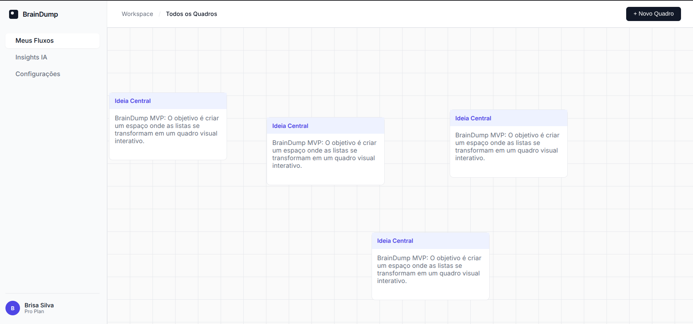
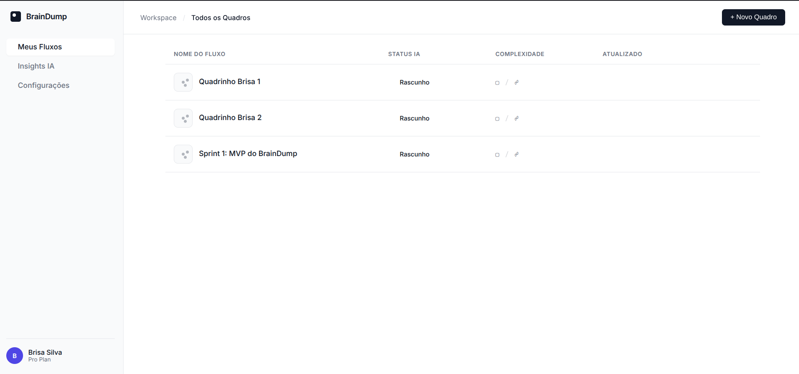

# BrainDump — Seu mural caótico de ideias, com superpoderes de IA
Um quadro infinito onde você solta pensamentos como blocos arrastáveis, conecta conceitos com fios e transforma bagunça em clareza. Django REST, Vue.js, JWT, PostgreSQL e integração com IA para sugerir clusters, relações e insights. Feito para virar sua mente de ponta-cabeça e organizá-la depois.

## Imagens iniciais 
### Canvas

### Listagem

